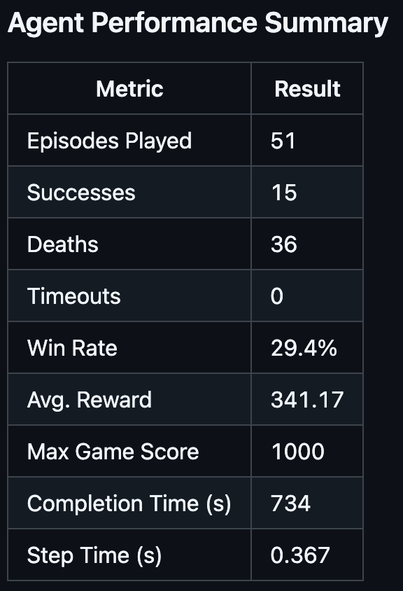

# Stable Entertainment System

## Overview

Stable Entertainment System (SES) is an on-policy agent training model that automates gameplay for the Super Nintendo Entertainment System (SNES). It uses [Stable Baselines 3 (SB3)](https://github.com/DLR-RM/stable-baselines3) and the [Asynchronous Advantage Actor Critic (A2C)](https://arxiv.org/abs/2205.09123) algorithm to learn how to play SNES games in the [SNES9x-rr](https://github.com/gocha/snes9x-rr/releases) emulator. SES was designed to automate gameplay for the game Super Mario World but supports extensibility to other SNES games.

## Key Topics

- **Agent Systems**
- **Reinforcement Learning**
- **Deep Reinforcement Learning**

## Table of Contents
- [Overview](#overview)
- [Key Topics](#key-topics)
- [Demo](#demo)
- [Description](#description)
- [Features](#features)
- [Software Utilized](#software-utilized)
- [Installation](#installation)
- [Usage](#usage)
- [Results](#results)
- [References](#references)
- [Legal Notice](#legal-notice)
- [License](#license)
- [Contributors](#contributors)

## Demo


## Description
### Program Overview and Runtime Behavior
This program automates installation and configuration of SB3 and SNES9x-rr emulator agents. Once installed, execution of the program creates an image-action pipeline that captures screenshots from the emulator, passes a data matrix of the image to SB3, processes the image to determine the inputs to be held during the next frame, and advances frames holding those inputs. A video file is automatically generated for the finalized gameplay.

### Game-Model Interaction Pipeline
SNES9x-rr leverages [Lua](https://www.lua.org/manual/5.4/) scripting to enable frame-specific game control within the emulator. [LuaSocket](https://lunarmodules.github.io/luasocket/) interfaces with Python for sending and receiving game data between agents over TCP. A custom Lua script retrieves memory values directly from the game as specified in the "Memory Watch" variable in lua_script.lua. The memory values and screenshot are passed to the SB3 environment. Once the next set of inputs is determined, they are passed back over the TCP LuaSocket connection to be processed by the emulator. The inputs are held during four successive frame advances, when a new screenshot is generated for the next iteration.


### Reinforcement Learning with A2C
The SB3 environment uses the A2C algorithm to determine which inputs to be processed during the next frame. A2C is an on-policy reinforcement learning algorithm that supports real-time learning from the current game state, using the active game frame. It is an actor-critic model that performs an action that a critic evaluates. Successful actions are encouraged and unsuccessful ones are discouraged, forming a policy. A2C was selected for its simulation of human abilities, learning from current gameplay to update the current strategy. Additionally, it works well with discrete action spaces like SNES games and supports entropy to prevent determinism.

The A2C model operates using the following reward function:


where Vc is the closing velocity between Mario and the goal post, c are reward weights, d is the distance between Mario and the goal post, P are the current positions of Mario and the goal post, V is Mario's current velocity, and R is an additional bonus or penalty for specific actions. A2C maximizes the reward per time (t) to move Mario toward the goal.

## Features
- This reinforcement learning program functions with SNES games. SNES game environments are more complex than previous studies, and have broad color ranges, high pixel densities, advanced physics, and diverse gameplay goals. Frames are more information-dense (i.e detailed backgrounds, enemy movement, diverse terrain) but are successfully handled by SES. Features useful to the model are extracted from captured frames.
- SES utilizes a novel framework. Stable Baselines 3 implements various RL algorithms with strong performance. Algorithms are model-free; no need to worry about underlying architecture. 
- Improve results in complicated environments:
Beneficial for externalizing to challenging data-dense environments (i.e. surgery, self-driving cars)
- SNES Mario makes this project applicable for testing and developing modern 2D platformers
Greenfield project: novel model previously unstudied in modern 2D platformers
Uses Sethbling’s performance as a baseline but with a completely distinct approach
Project requires no prior gameplay data
Performs actions at a human-achievable rate
Algorithm choices are not tied to specific model architecture
Model requires mostly visual inputs
Uses policies inspired by drone navigation studies

## Software Utilized

- [**SNES9X-rr v1.51**](https://github.com/gocha/snes9x-rr)  
  A modified version of the SNES9X emulator that enables recordings and Lua scripting. This serves as the agent.
  *License: Freeware for personal use; GPL/LGPL for included components (JMA, snes_ntsc, xBRZ)*

- [**Stable Baselines3 (SB3)**](https://github.com/DLR-RM/stable-baselines3)  
  A machine learning framework used to implement actor-critic algorithms with strong results.
  *License: MIT*

- [**Python**](https://github.com/python/cpython)  
  Interfaces the emulator and machine learning agents.
  *License: Python Software Foundation License (PSF License)*

## Installation
Follow these steps to install and run the project:

### Install the Environments
1. **Clone the repository** or [download the ZIP](https://github.com/your-username/your-repo-name/archive/refs/heads/main.zip) and extract it:

   ```bash
   git clone https://github.com/LDELZ/Stable-Entertainment-System
   cd Stable-Entertainment-System

2. **Install dependencies** from `requirements.txt`:

  ```bash
  pip install -r requirements.txt
> **Note** that the SB3 environment is highly sensitive to requirement changes. SB3 will automatically install any necessary requirements using the `install_requirements.bat` file after the initial setup.

3. **Run emulator_initialize.py** to automatically download the environments and configure them:
> **Note** that you must follow the prompts if any files are missing. A valid Super Mario World ROM file is required, but is not distributed in any way with this software. Any ROM files must be obtained on the user's own volition. Please read the [Legal Notice](#legal-notice) for more information.
  '''bash
  ./.venv/bin/python emulator_initialize.py

### Creat the initial save state
4. **Load the snes9x.exe executable** in the snes9x folder of the repository's directory.

5. **Load the smw.sfc ROM** using `File > Open ROM...` and selecting the ROM file.

6. **Navigate to the desired level** you wish to train the model on within the loaded game environment. The default keyboard mappings to control SNES9x-rr are as follows:

| SNES Button | Keyboard |
|-------------|----------|
| Up          | Up       |
| Left        | Left     |
| Down        | Down     |
| Right       | Right    |
| B           | C        |
| A           | V        |
| Y           | X        |
| X           | D        |
| R           | S        |
| Start       | Space    |
| Select      | Enter    |
| L           | A        |

7. **Generate a save state file** using `File > Save Game > Slot #0` in SNES9x-rr.
> **Note** that a save state is mandatory for the program to function. SB3 reverts to the save state during model training when in-game events that affect the reward function occur. Save states should be captured as close as possible to the beginning of level rendering. State loading is handled automatically, and does not need to be performed manually after creating the first save state.

## Initiate Training
## Results
The following video demonstrates a sample of training results using SES with studied metrics.
<table>
  <tr>
    <td>
      
    </td>
    <td style="padding-left: 20px;">
      
    </td>
  </tr>
</table>

## Limitations
- Unrealistic Behaviors: The model can perform inputs with conflicting directions, leading to impossible neural network states than would be achievable on original hardware by human players. Restricting key combinations to valid set of possible inputs may improve model stability.
- Training Instability: Current training on a custom level results in model decay and overfitting. A set of custom levels is needed to teach the model how to handle diverse obstacles and environments
- Limited Visual Cues: Screenshots do not provide enough information for all objects to be detected. Additional memory values (e.g., enemy positions) are required for proper model understanding. Possible solutions can include investigations into enemy sprite tracking for better screenshot information retrieval.
- Efficiency: Screenshot feedback is slow and is the primary limiter for training speed. Python should be integrated directly into the emulator to improve feedback pipeline efficiency.

## References

- [Quadcopter Guidance Law Design using Deep Reinforcement Learning (Aydinli & Kutay, 2023)](https://doi.org/10.1109/RAST57548.2023.10197848)
- [Deep Reinforcement Learning in Computer Vision: A Comprehensive Survey (Le et al., 2021)](https://arxiv.org/abs/2108.11510)
- [Playing Atari with Deep Reinforcement Learning (Mnih et al., 2013)](https://arxiv.org/abs/1312.5602)
- [Soft Actor-Critic: Off-Policy Maximum Entropy Deep Reinforcement Learning (Haarnoja et al., 2018)](https://arxiv.org/abs/1801.01290)
- [A2C Is a Special Case of PPO (Huang et al., 2022)](https://arxiv.org/abs/2205.09123)
- [Stable-Baselines3: Reliable Reinforcement Learning Implementations (Raffin et al., 2021)](https://www.jmlr.org/papers/v22/20-1364.html)
- [MarI/O - Machine Learning for Video Games (SethBling, 2015)](https://www.youtube.com/watch?v=qv6UVOQ0F44)
- [Proximal Policy Optimization Algorithms (Schulman et al., 2017)](https://arxiv.org/abs/1707.06347)
- [AI for Classic Video Games using Reinforcement Learning (Sodhi, 2017)](https://scholarworks.sjsu.edu/etd_projects/538)

## Legal Notice

This project is intended for research and educational purposes only. We **do not condone or support software piracy** of any kind. Any references to Super Mario World or other game ROMs are made strictly in the context of technical compatibility and emulator integration for reinforcement learning research. SES requires a legitimately-obtained ROM file for Super Mario World, or any other game you wish to automate. No ROM files are provided, and any ROM must be obtained on the user's own volition. It is your responsibility to ensure that you comply with all applicable local, national, and international copyright laws when obtaining ROM files for automation. This project **does not provide or distribute any copyrighted ROM files**, and we **stand strongly against piracy** in any form.

## License

This project is licensed under the [Apache License 2.0](https://www.apache.org/licenses/LICENSE-2.0).  
You may use, modify, and distribute this software in compliance with the license terms. See the `LICENSE` file for more details.

## Contributors
**Authors**:
- **Brennan Romero** – Developer – [bromero@uccs.edu](mailto:jbromero@uccs.edu)
- **Luke Delzer** – [ldelzer@uccs.edu](mailto:ldelzer@uccs.edu)

