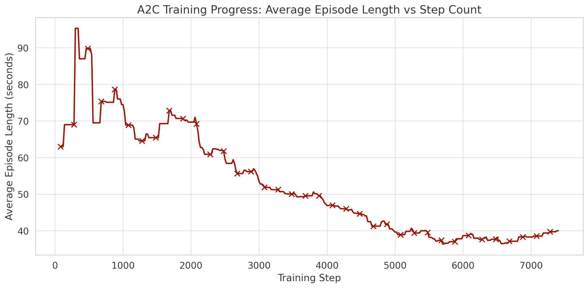

# Stable Entertainment System

## Overview

Stable Entertainment System (SES) is an on-policy agent training model that uses reinforcement learning to automate gameplay for the Super Nintendo Entertainment System (SNES). It uses [Stable Baselines 3 (SB3)](https://github.com/DLR-RM/stable-baselines3) and the [Asynchronous Advantage Actor Critic (A2C)](https://arxiv.org/abs/2205.09123) algorithm to learn how to play SNES games in the [SNES9x-rr](https://github.com/gocha/snes9x-rr/releases) emulator. SES was designed to automate gameplay for the game Super Mario World but supports extensibility to other SNES games.

## Key Topics

- **Agent Systems**
- **Reinforcement Learning**
- **Deep Reinforcement Learning**

## Table of Contents
- [Overview](#overview)
- [Key Topics](#key-topics)
- [Demo](#demo)
- [Description](#description)
- [Features](#features)
- [Software](#software)
- [Compatibility](#compatibility)
- [Installation](#installation)
- [Usage](#usage)
- [Results](#results)
- [Limitations](#limitations)
- [References](#references)
- [Legal Notice](#legal-notice)
- [License](#license)
- [Contributors](#contributors)

## Demo
The following video demonstrates a sample of training results using SES with studied metrics.
<div style="display: flex; align-items: flex-start; gap: 20px;">
<div>
  
</div>
<div>

| Metric              | A2C       |
|---------------------|-----------|
| Episodes Played     | 51        |
| Successes           | 15        |
| Deaths              | 36        |
| Timeouts            | 0         |
| Win Rate            | 29.4%     |
| Avg. Reward         | 341.17    |
| Max Game Score      | 1000      |
| Completion Time (s) | 734       |
| Step Time (s)       | 0.367     |

</div>
</div>


## Description
### Program Overview and Runtime Behavior
This program automates installation and configuration of SB3 and SNES9x-rr emulator agents. Once installed, execution of the program creates an image-action pipeline that captures screenshots from the emulator, passes a data matrix of the image to SB3, processes the image to determine the inputs to be held during the next frame, and advances frames holding those inputs. A video file is automatically generated for the finalized gameplay.

### Game-Model Interaction Pipeline
SNES9x-rr leverages [Lua](https://www.lua.org/manual/5.4/) scripting to enable frame-specific game control within the emulator. [LuaSocket](https://lunarmodules.github.io/luasocket/) interfaces with Python for sending and receiving game data between agents over TCP. A custom Lua script retrieves memory values directly from the game as specified in the "Memory Watch" variable in lua_script.lua. The memory values and screenshot are passed to the SB3 environment. Once the next set of inputs is determined, they are passed back over the TCP LuaSocket connection to be processed by the emulator. The inputs are held during four successive frame advances, when a new screenshot is generated for the next iteration.
<br><br>

### Reinforcement Learning with A2C
The SB3 environment uses the A2C algorithm to determine which inputs to be processed during the next frame. A2C is an on-policy reinforcement learning algorithm that supports real-time learning from the current game state, using the active game frame. It is an actor-critic model that performs an action that a critic evaluates. Successful actions are encouraged and unsuccessful ones are discouraged, forming a policy. A2C was selected for its simulation of human abilities, learning from current gameplay to update the current strategy. Additionally, it works well with discrete action spaces like SNES games and supports entropy to prevent determinism.

The A2C model operates using the following reward function:<br><br>


where Vc is the closing velocity between Mario and the goal post, c are reward weights, d is the distance between Mario and the goal post, P are the current positions of Mario and the goal post, V is Mario's current velocity, and R is an additional bonus or penalty for specific actions. A2C maximizes the reward per time (t) to move Mario toward the goal.

Entropy was added to encourage model exploration and reduce determinism. As a result, the model may attempt riskier movements when entropy is high.

## Features
- This reinforcement learning program functions with SNES games. SNES game environments are more complex than previous studies, have broad color ranges, high pixel densities, advanced physics, and diverse gameplay goals. Frames are more information-dense (i.e detailed backgrounds, enemy movement, diverse terrain), but are successfully handled by SES. Features useful to the model are extracted from captured frames. Training models to control complex agents has broader implications that are beneficial for externalizing to challenging, data-dense environments.
- SES utilizes a novel framework with SB3, which implements various RL algorithms with strong performance, and is model-free. Therefore there is no need to worry about the underlying architecture. 
- SNES Mario makes this project applicable for testing and developing modern 2D platformers. Reinforcement learning models capable of controlling modern 2D platformers are scarcely studied, and the use of Mario enables similar studies for many other games of similar complexity.
- Model training requires no prior gameplay data, and performs actions at a human-achievable rate.

## Software

- [**SNES9X-rr v1.51**](https://github.com/gocha/snes9x-rr)  
  A modified version of the SNES9X emulator that enables recordings and Lua scripting. This serves as the agent.  
  *License: Freeware for personal use; GPL/LGPL for included components (JMA, snes_ntsc, xBRZ)*

- [**Stable Baselines3 (SB3)**](https://github.com/DLR-RM/stable-baselines3)  
  A machine learning framework used to implement actor-critic algorithms with strong results.  
  *License: MIT*

- [**Python**](https://github.com/python/cpython)  
  Interfaces the emulator and machine learning agents.  
  *License: Python Software Foundation License (PSF License)*

- [**MarI/O**](https://gist.github.com/SethBling/598639f8d5e8afb5453a0b9519be51ff)  
  Uses a neural grid and genetic programming to beat levels in Super Mario World.  
  *License: “Feel free to use this code, but please do not redistribute it.”*

## Compatibility
- Windows Operating Systems 10 and higher

> **Note** that compatibility is limited based on the use of the SNES9x-rr emulator. However, SNES9x-rr was selected for its support of [Bulletproof Recording](https://tasvideos.org/EmulatorResources#EmulatorOverview), [Lua](https://www.lua.org/manual/5.4/) scripting, and [LuaSocket](https://lunarmodules.github.io/luasocket/) . Bulletproof recording is required to concatenate videos that are captured when loading a game state occurs. Lua scripting is required for memory reading and automated input, and LuaSocket is required for interfacing with other programs over TCP. Currently, alternative emulators satisfying these requirements are extremely limited.

## Installation
Follow these steps to install and run the project:

### Install the Environments
1. **Clone the repository** or [download the ZIP](https://github.com/your-username/your-repo-name/archive/refs/heads/main.zip) and extract it:

   ```bash
   git clone https://github.com/LDELZ/Stable-Entertainment-System
   cd Stable-Entertainment-System
    ```

2. **Install dependencies** from `requirements.txt`:

   ```bash
    pip install -r requirements.txt
   ```
> **Note** that the SB3 environment is highly sensitive to requirement changes. SB3 will automatically install any necessary requirements using the `install_requirements.bat` file after the initial setup.

3. **Run emulator_initialize.py** to automatically download the environments and configure them:


    ```bash
    ./.venv/bin/python emulator_initialize.py
    ```
> **Note** that you must follow the prompts if any files are missing. A valid Super Mario World ROM file is required, but is not distributed in any way with this software. Any ROM files must be obtained on the user's own volition. Please read the [Legal Notice](#legal-notice) for more information.

### Create the initial save state
4. **Load the snes9x.exe executable** in the snes9x folder of the repository's directory.

5. **Load the smw.sfc ROM** using `File > Open ROM...` and selecting the ROM file.

6. **Navigate to the desired level** you wish to train the model on within the loaded game environment. The default keyboard mappings to control SNES9x-rr are as follows:

<div align="center">

| SNES Button | Keyboard |   | SNES Button | Keyboard |
|-------------|----------|---|-------------|----------|
| Up          | Up       |   | X           | D        |
| Left        | Left     |   | R           | S        |
| Down        | Down     |   | Start       | Space    |
| Right       | Right    |   | Select      | Enter    |
| B           | C        |   | L           | A        |
| A           | V        |   | Y           | X        |

</div>

7. **Generate a save state file** using `File > Save Game > Slot #0` in SNES9x-rr.
> **Note** that a save state is mandatory for the program to function. SB3 reverts to the save state during model training when in-game events that affect the reward function occur. Save states should be captured as close as possible to the beginning of level rendering. State loading is handled automatically, and does not need to be performed manually after creating the first save state.

### Customizing monitored RAM values
8. **Modify the "Addresses to monitor" block** of the `memory_server.lua' script to track different memory values and pass them to the SB3 environment.

  ```lua
  -- Addresses to monitor
  local ram_addresses = {
      0x7E00D1, -- Mario's X position in the current level (Lower byte)
      0x7E00D2, -- Mario's X position in the current level (Upper byte)
      0x7E00D3, -- Mario's Y position in the current level (Lower byte)
      0x7E00D4, -- Mario's Y position in the current level (Upper byte)
      0x7E0071, -- Mario animation state flag
  }
  ```
> **Note** that the current implementation will function without updating these values. If users wish to attempt improvements to the reward function that require different RAM conditions, updating this list of addresses will automatically pass the values to the SB3 environment. A complete repository of memory mappings for Super Mario World is available publicly at [SMWCentral](https://www.smwcentral.net/?p=memorymap&game=smw&region=ram).

## Usage
### Training the Model
1. **Execute the `Train.py` file** in the project's root directory.

   ```bash
    python Train.py
   ```
>**Note** that once the model is trained, a model checkpoint is saved to the `models/` directory in the project root as a [Python pickle](https://docs.python.org/3/library/pickle.html) binary archive. A model is automatically saved every 1000 steps so performance can be captured for multiple models at different training levels. Model performance will be outputted to the `logdata/` directory in the project's root directory. Log data includes reward value, episode length, policy loss, and entropy loss per step. Log data is formatted as follows:

<div align="center">
  
| Wall Time     | Step | Value       |
|---------------|------|-------------|
| 1744720333    | 80   | 313.3702393 |
| 1744720340    | 100  | 313.3702393 |
| 1744720347    | 120  | 313.3702393 |

</div>

### Testing the Model
2. **Navigate to a new level** using the same process as Step 6 from the [Installation](#installation) section above.
3. **Execute the `Enjoy.py` file** in the project's root directory after a model has been trained and appears in `models/`.

   ```bash
    python Enjoy.py
   ```
> **Note** that the model will be automatically loaded for testing. Once complete, performance results will output to the console in the format displayed below.

<div align="center">
  
| Metric       | Value        |
|--------------|--------------|
| Beat         | 15           |
| Died         | 30           |
| Timed Out    | 5            |
| Win Rate     | 30.00%       |
| Avg. Reward  | 312.45       |

</div>

## Results
### Training Environment
A custom training level was programmed to challenge the reward function, ensuring that the model learns meaningful gameplay (i.e., it cannot simply hold right to win). This approach reduces overfitting to simplistic movement patterns by introducing multiple paths that encourage dynamic solutions. The level also incorporates interactive elements, such as springs and shells, to support the learning of dynamic behaviors.
<div align="center">

</div>

### Evaluation Metrics
In-game model performance was measured using the following metrics: Episodes Played, Successes, Deaths, Timeouts, Win Rate, Average Reward, Maximum Game Score, Completion Time (seconds), Step Time (seconds). These metrics encompass a comprehensive array of in-game performance values, as well as model-training and computational performance data. The A2C algorithm-based model will be compared to [SethBling's](https://gist.github.com/SethBling/598639f8d5e8afb5453a0b9519be51ff) baseline for each of these metrics. Model training performance was measured using the average reward, average episode length, policy loss, and entropy loss per step.

### Baseline
A neural network-based AI agent called “MarI/O” was developed by [SethBling (2015)](https://gist.github.com/SethBling/598639f8d5e8afb5453a0b9519be51ff) using genetic algorithms to play Super Mario World. The system creates a small, discrete spatial grid based on in-game sprites. Neurons are connected to cells in the grid, which are connected to other neurons or controller outputs. The network evolves over time using principles from natural selection to gradually develop the ability to play the game. However, due to the fixed nature of the sprite-grid mapping, the trained network has difficulty adapting to new levels. SethBling's model was implemented on the custom level to generate baseline performance results.
<div align="center">

</div>

### Training Results
The average reward (left) and episode length (right) per step are displayed in the plots below. 

<table>
  <tr>
    <td></td>
    <td></td>
  </tr>
</table>

During the initial steps, there is a wide variance in reward per step due to the model gaining initial understandings of how to improve reward and interact with level obstacles. The model has no understanding of the environment at the beginning, making policy behaviors random. Some of these random initial actions are good, while others are poor. The reward stabilizes as the model attempts to exploit potentially useful rewards. At approximately 2000 steps, the model achieves a local optimum. Here, a balance of reward exploitation and exploration is achieved, leading to a reasonable understanding of how to progress without taking overly-risky exploits. This trend is observed between both the average reward and episode length per step, and these concepts are closely linked. Since the episode length is the amount of time that Mario stays alive, the balance that achieves the optimal reward will lead to a corresponding greater success in goal progression. At this point, the model has learned more consistent behaviors, has seen more of the level, has converged on a pattern, and can generalize to other obstacles.

Reward function parameters were manually modified to produce a positive trend in reward with increased learning. The optimal model producxed from these values was saved for testing and comparison. The parameters used to produce the optimal model are displayed belolw.

<div align="center">

| Parameter             | Value  | Description                    |
|-----------------------|--------|--------------------------------|
| `C1`                  | 1.8    | Weight for closing velocity 1  |
| `C2`                  | 1.1    | Weight for closing velocity 2  |
| Finish Level Reward   | 30     | Reward for completing level    |
| Death Penalty         | 40     | Punishment for dying           |

</div>

In both scenarios, the model begins to decay after 2000 and 3000 steps. This is potentially due to poor trends being propogated by the current understanding of the on-policy model, or due to overfitting to short-term rewards in the simplified level. Plotting the policy loss below (left) confirms this trend, where the smallest policy loss is exhibited at approximately 2500 steps, when becomes unstable shortly after. Large variances in loss magnitude are observable from the decayed model. 

The entropy loss per training step is plotted below (right). As discussed in the algorithm [Description](#description), entropy was added to encourage model exploration and reduce determinism. As a result, the model may attempt riskier movements when entropy is high. This is used to encourage exploration or make increasingly aggressive maneuvers to overcome inabilities to progress. The plot demonstrates that entropy increases gradually with time, making Mario's behaviors less stable with increased training. This could be due to overfitting to a certain set of behaviors that maximize short-term rewards, but fail to achieve long-term goals like completing the level. It could also be the result of poor performance being propagated by the model such that increasingly erratic behaviors are used to overcome the decline. Future evaluation of entropy and model decay will be conducted.

<table>
  <tr>
    <td></td>
    <td></td>
  </tr>
</table>

### Comparison to Baseline
The optimal model at 2000 training steps was preserved for comparison to the baseline. The game and computational performance metrics for the A2C-based model and [SethBling's](https://gist.github.com/SethBling/598639f8d5e8afb5453a0b9519be51ff) MarI/O are tabulated below. A paired bar chart of normalized metric values is provided for simpler comparison. All results were generated within a fixed 12 minute timeframe to limit computational burden.

<div style="display: flex; align-items: flex-start; gap: 20px;">

<div>

<!-- Your original table preserved -->
  
| Metric              | A2C       | MarI/O   |
|---------------------|-----------|----------|
| Episodes Played     | 51        | 223      |
| Successes           | 15        | 0        |
| Deaths              | 36        | 189      |
| Timeouts            | 0         | 34       |
| Win Rate            | 29.4%     | 0%       |
| Avg. Reward         | 341.17    | 98.13    |
| Max Game Score      | 1000      | 500      |
| Completion Time (s) | 734       | —        |
| Step Time (s)       | 0.367     | 0.11     |

</div>

<div>
  
</div>

</div>

A2C demonstrates superiority over MarI/O, with a higher success rate, fewer deaths, fewer timeouts, and a better average reward. A2C does demonstrate a slower average step time compared to MarI/O, however it achieves faster overall convergence and level completion, therefore demonstrating that the simplified grid computations in MarI/O are faster to compute, but provide less learning abilities that A2C. Several factors may contribute to the superior performance of A2C versus MarI/O. Better pixel mapping is possible with A2C, which interprets information from an entire screenshot image, compared to MarI/O's simplified grid mapping. This potentially leads to better information retrieval for improved model training. A2C may converge faster because it saves model improvements after each batch. The model-free, on-policy nature of A2C allows for more frequent and responsive model updates. Compared to MarI/O's genetic algorithm, numerous episodes to determine the best-performing population are required before advancing to the next generation, leading to drastically longer processing times.

## Testing Progress
Testing the trained models on original game levels has proved challenging due to differences in training and testing level properties. Original levels are too sparse, leading to impaired model learning with inconsistent initial feedback. Increasing the diversity of the training environment could potentially improve the feedback network to enable better learning. The reward function may need to be further modified to account for initial level sparsity. Additionally, research into entropy and reward behaviors may allow an inversion of entropy changes per step. Ideally, high entropy would occur at the beginning of training and decrease after the model converges on a solution for completing the level. This approach would encourage early exploration and aid in handling initial environment uncertainty.

## Limitations
Unrealistic behaviors are possible. The model can perform inputs with conflicting directions, leading to impossible neural network states than would be achievable on original hardware by human players. Restricting key combinations to valid set of possible inputs may improve model stability. Training demonstrates model instability. Current training on the custom level results in model decay and overfitting. A set of custom levels is needed to teach the model how to handle diverse obstacles and environments. Limitions to visual cues in still screenshots exist. Screenshots do not provide enough information for all objects to be detected. Additional memory values (e.g., enemy positions) are required for proper model understanding. Possible solutions can include investigations into enemy sprite tracking for better screenshot information retrieval Model training is generally inefficient. Screenshot feedback is slow and is the primary limiter for training speed. Python should be integrated directly into the emulator to improve feedback pipeline efficiency.

## Conclusion
A2C via SB3 is capable of learning appropriate inputs for agent control of complex games from primarily visual data. As demonstrated, most information required for learning can be taken from the in-game screenshots. A2C is superior to MarI/O's genetic model for Super Mario World, with a win rate of 29% compared to 0%, respectively. Additionally, A2C converges faster than MarI/O's neural model and has superior in-game performance. Despite success in custom levels, overfitting and sparsity limit generalization to original levels in Super Mario World. This research demonstrates potential utility in other visually-dense games, which may advance the understanding of automated gameplay in informationally dense games or in broader agent systems.

## References

- [Quadcopter Guidance Law Design using Deep Reinforcement Learning (Aydinli & Kutay, 2023)](https://doi.org/10.1109/RAST57548.2023.10197848)
  >Aydinli, Sevket Utku, and Ali Turker Kutay. Quadcopter Guidance Law Design using Deep Reinforcement Learning. 2023. IEEE, https://doi.org/10.1109/RAST57548.2023.10197848.
- [Deep Reinforcement Learning in Computer Vision: A Comprehensive Survey (Le et al., 2021)](https://arxiv.org/abs/2108.11510)
  >Le, Ngan, et al. Deep Reinforcement Learning in Computer Vision: A Comprehensive Survey. 2021. arXiv, https://arxiv.org/abs/2108.11510.
- [Playing Atari with Deep Reinforcement Learning (Mnih et al., 2013)](https://arxiv.org/abs/1312.5602)
  >Mnih, Volodymyr, et al. Playing Atari with Deep Reinforcement Learning. DeepMind Technologies, 2013. arXiv, https://arxiv.org/abs/1312.5602.
- [Soft Actor-Critic: Off-Policy Maximum Entropy Deep Reinforcement Learning (Haarnoja et al., 2018)](https://arxiv.org/abs/1801.01290)
  >Haarnoja, Tuomas, et al. "Soft Actor-Critic: Off-Policy Maximum Entropy Deep Reinforcement Learning with a Stochastic Actor." arXiv preprint, 2018, arxiv.org/abs/1801.01290.
- [A2C Is a Special Case of PPO (Huang et al., 2022)](https://arxiv.org/abs/2205.09123)
  >Huang, Shengyi, et al. "A2C Is a Special Case of PPO." arXiv preprint, 2022, arxiv.org/abs/2205.09123.
- [Stable-Baselines3: Reliable Reinforcement Learning Implementations (Raffin et al., 2021)](https://www.jmlr.org/papers/v22/20-1364.html)
  >Raffin, Antonin, et al. "Stable-Baselines3: Reliable Reinforcement Learning Implementations." Journal of Machine Learning Research, vol. 22, no. 268, 2021, pp. 1–8, jmlr.org/papers/v22/20-1364.html.
- [MarI/O - Machine Learning for Video Games (SethBling, 2015)](https://www.youtube.com/watch?v=qv6UVOQ0F44)
  >SethBling, MarI/O - Machine Learning for Video Games., 2015. https://www.youtube.com/watch?v=qv6UVOQ0F44.
- [Proximal Policy Optimization Algorithms (Schulman et al., 2017)](https://arxiv.org/abs/1707.06347)
  >Schulman, John, et al. "Proximal Policy Optimization Algorithms." arXiv preprint, 2017, arxiv.org/abs/1707.06347.
- [AI for Classic Video Games using Reinforcement Learning (Sodhi, 2017)](https://scholarworks.sjsu.edu/etd_projects/538)
  >Sodhi, Shivika. AI for Classic Video Games using Reinforcement Learning. Master's project, San José State University, 2017. San José State University ScholarWorks, https://scholarworks.sjsu.edu/etd_projects/538.

## Legal Notice

This project is intended for research and educational purposes only. We **do not condone or support software piracy** of any kind. Any references to Super Mario World or other game ROMs are made strictly in the context of technical compatibility and emulator integration for reinforcement learning research. SES requires a legitimately-obtained ROM file for Super Mario World, or any other game you wish to automate. No ROM files are provided, and any ROM must be obtained on the user's own volition. It is your responsibility to ensure that you comply with all applicable local, national, and international copyright laws when obtaining ROM files for automation. This project **does not provide or distribute any copyrighted ROM files**, and we **stand strongly against piracy** in any form.

## License

This project is licensed under the [Apache License 2.0](https://www.apache.org/licenses/LICENSE-2.0).  
You may use, modify, and distribute this software in compliance with the license terms. See the `LICENSE` file for more details.

## Contributors
**Authors**:
- **Luke Delzer** – Developer - [ldelzer@uccs.edu](mailto:ldelzer@uccs.edu)
- **Brennan Romero** – Developer – [bromero@uccs.edu](mailto:jbromero@uccs.edu)


